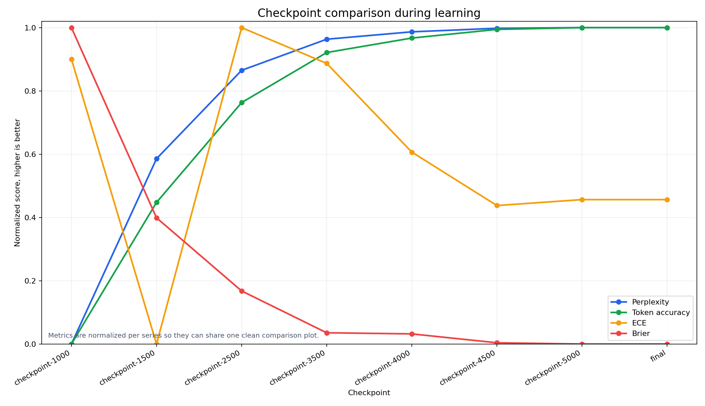

# Nano Alpha 130M Pretraining Project


[](LICENSE)


This repository documents a full small scale language model pipeline. The model is a 130M parameter Llama style causal language model trained from scratch on a mixed English and German corpus. The project is built for clear tracking, checkpoint based analysis, and practical evaluation.

The goal is not only to train a model. The goal is to understand how model quality changes across checkpoints, how confidence behaves, and how to compare runs in a repeatable way.

## Why this project exists

Many small pretraining projects only report loss curves. That is not enough if we want to make good decisions. In this project we treat evaluation as a main part of the pipeline.

We track:

1. Language modeling quality
2. Calibration and confidence behavior
3. Benchmark performance on standard tasks
4. Checkpoint dynamics over training time

## Model snapshot

| Item | Value |
|---|---|
| Model type | Decoder only causal language model |
| Architecture family | Llama style transformer |
| Parameter count | 130M |
| Hidden size | 768 |
| Intermediate size | 2048 |
| Number of layers | 12 |
| Number of attention heads | 12 |
| Max position embeddings | 1024 |
| Tokenizer | Byte level BPE |
| Vocab size | 32000 |
| Languages | English and German |

## Project pipeline

1. Phase 0. Environment and dependency setup
2. Phase 1. Data preparation and contamination control
3. Phase 2. Pretraining and checkpointing
4. Phase 3. Intrinsic evaluation
5. Phase 4. Benchmark evaluation
6. Phase 5. Checkpoint dynamics analysis
7. Phase 6. Reporting and cross run comparison

Detailed phase notes are in this repository:

1. [Tokenizer phase details](docs/TOKENIZER_PHASE.md)
2. [Training Q and A](docs/TRAINING_QA.md)
3. [Resume guide](docs/TRAINING_RESUME.md)
4. [Master project plan](docs/Idea_discussion.md)
5. [Phase 0 environment setup](docs/PHASE_0_ENVIRONMENT_SETUP.md)
6. [Phase 1 data preparation](docs/PHASE_1_DATA_PREPARATION.md)
7. [Phase 2 pretraining and checkpointing](docs/PHASE_2_PRETRAINING_AND_CHECKPOINTING.md)
8. [Phase 3 intrinsic evaluation](docs/PHASE_3_INTRINSIC_EVALUATION.md)
9. [Phase 4 benchmark evaluation](docs/PHASE_4_BENCHMARK_EVALUATION.md)
10. [Phase 5 checkpoint dynamics](docs/PHASE_5_CHECKPOINT_DYNAMICS.md)
11. [Phase 6 reporting and comparison](docs/PHASE_6_REPORTING_AND_COMPARISON.md)

## Data and preprocessing

The data pipeline builds train and validation JSONL corpora and keeps processing reproducible.

Main points:

1. Canonical train and validation outputs are created in `data/processed/`
2. Data preparation logs and manifests are saved
3. MinHash filtering is used to reduce contamination risk

Useful docs:

1. [Data preparation guide](docs/prepare_data.md)
2. [MinHash filtering guide](docs/minhash_filter.md)

## Tokenizer

Tokenizer training script:

`scripts/train_tokenizer.py`

Tokenizer phase notes:

1. [Tokenizer phase details](docs/TOKENIZER_PHASE.md)

Generated tokenizer artifacts are stored under `artifacts/tokenizer/`.

## Training setup

Training script:

`scripts/train.py`

Main SLURM scripts:

1. `slurm/phase2_train_v100.sbatch`
2. `slurm/phase2_train_v100_resume.sbatch`

Key training choices:

1. Step based checkpointing for resume and evaluation
2. MLflow and optional W and B tracking
3. Resume support from checkpoint paths
4. HPC friendly fallback behavior in job scripts

Training run notes:

1. [Training Q and A](docs/TRAINING_QA.md)
2. [Resume guide](docs/TRAINING_RESUME.md)

## Phase 3 intrinsic evaluation

Intrinsic evaluation script:

`scripts/phase3_intrinsic_eval.py`

V100 scheduler entry point:

`slurm/phase3_intrinsic_eval_v100.sbatch`

What it computes per checkpoint:

1. Cross entropy and perplexity
2. Token accuracy and average confidence
3. ECE and Brier score
4. Reliability diagram
5. Selective prediction risk coverage curve
6. Domain or language breakdown

Latest intrinsic summary snapshot from Phase 3 run:

| Checkpoint | Perplexity | Token Accuracy | ECE | Brier |
|---|---:|---:|---:|---:|
| checkpoint-1000 | 162.06 | 0.2091 | 0.0111 | 0.1201 |
| checkpoint-1500 | 94.54 | 0.2692 | 0.0183 | 0.1314 |
| checkpoint-2500 | 62.32 | 0.3116 | 0.0103 | 0.1357 |
| checkpoint-3500 | 50.98 | 0.3329 | 0.0112 | 0.1382 |
| checkpoint-4000 | 48.28 | 0.3390 | 0.0134 | 0.1383 |
| checkpoint-4500 | 46.99 | 0.3427 | 0.0148 | 0.1388 |
| checkpoint-5000 | 46.75 | 0.3434 | 0.0147 | 0.1389 |
| final | 46.75 | 0.3434 | 0.0147 | 0.1389 |

Interpretation in plain language:

1. Perplexity improves strongly as training progresses.
2. Token accuracy also increases steadily.
3. ECE remains low but does not improve monotonically.
4. Final and checkpoint-5000 are effectively identical in this run.

Comparison plot for all checkpoints is saved in:



This figure uses one clean plot with a legend and normalized metric trends so checkpoints are easy to compare at a glance.

Phase 3 reference:

1. [Phase 3 document](docs/PHASE_3_INTRINSIC_EVALUATION.md)

## Benchmarking plan

Benchmarking is planned through a checkpoint sweep using lm eval harness.

Target tasks:

1. MMLU
2. ARC
3. HellaSwag
4. TruthfulQA
5. IGEL

The benchmark section is organized in:

1. [Phase 4 document](docs/PHASE_4_BENCHMARK_EVALUATION.md)

## Training curves and analysis artifacts

Curve generation script:

`scripts/plot_training_curves.py`

Typical outputs:

1. Loss curve CSV
2. Loss curve PNG
3. Interactive HTML dashboard
4. Summary metrics JSON

Default output path:

`artifacts/plots/`

## Quick start

### 1) Environment

```bash
python -m venv .py312
source .py312/bin/activate
pip install -r requirements.txt
```

### 2) Train tokenizer

```bash
python -u scripts/train_tokenizer.py \
	--train-file data/processed/phase1_v2_de_eval/train_corpus.jsonl \
	--vocab-size 32000 \
	--min-frequency 2 \
	--output-dir artifacts/tokenizer \
	--name nano_alpha_bpe
```

### 3) Submit training on V100

```bash
sbatch slurm/phase2_train_v100.sbatch
```

### 4) Resume from last checkpoint

```bash
sbatch slurm/phase2_train_v100_resume.sbatch checkpoints/nano-alpha-130m-v100/checkpoint-5000 10000
```

### 5) Run Phase 3 intrinsic evaluation on V100

```bash
sbatch slurm/phase3_intrinsic_eval_v100.sbatch
```

## Repository layout

```text
nano-alpha-llm-pretrain/
	scripts/        # training, tokenizer, evaluation, plotting
	slurm/          # scheduler entry points
	docs/           # phase notes and run guides
	data/           # processed corpora
	artifacts/      # generated plots, tokenizer, eval outputs
	checkpoints/    # generated checkpoints
```

## Reproducibility notes

1. Keep the same tokenizer for all compared runs
2. Record all non default CLI flags for training and evaluation
3. Keep at least one resume safe checkpoint
4. Use fixed checkpoint cadence for fair checkpoint level comparison
5. Save metrics and plots for each run under a unique output directory

## Limitations

1. A 130M model has limited reasoning depth compared with larger models
2. Benchmark results can vary with prompt format and harness settings
3. Calibration metrics can shift with domain mix in the validation set
4. Cluster queue and wall time limits can affect training continuity

## License

This project uses the MIT License.

1. Full license text: [LICENSE](LICENSE)
2. Code is released under MIT.
3. Data and model sharing still must follow upstream dataset and model policy constraints.

## Citation

If you use this repository, please cite the following works that guide the architecture and evaluation direction.

1. Touvron et al., LLaMA: Open and Efficient Foundation Language Models, 2023
2. Touvron et al., Llama 2: Open Foundation and Fine Tuned Chat Models, 2023
3. Liang et al., Holistic Evaluation of Language Models, Transactions on Machine Learning Research, 2023

Example BibTeX entries:

```bibtex
@article{touvron2023llama,
	title={LLaMA: Open and Efficient Foundation Language Models},
	author={Touvron, Hugo and Lavril, Thibaut and Izacard, Gautier and Martinet, Xavier and Lachaux, Marie-Anne and Lacroix, Timothee and Roziere, Baptiste and Goyal, Naman and Hambro, Eric and Azhar, Faisal and others},
	journal={arXiv preprint arXiv:2302.13971},
	year={2023}
}

@article{touvron2023llama2,
	title={Llama 2: Open Foundation and Fine-Tuned Chat Models},
	author={Touvron, Hugo and Martin, Louis and Stone, Kevin and Albert, Peter and Almahairi, Amjad and Babaei, Yasmine and Bashlykov, Nikolay and Batra, Soumya and Bhargava, Prajjwal and Bhosale, Shruti and others},
	journal={arXiv preprint arXiv:2307.09288},
	year={2023}
}

@article{liang2023helm,
	title={Holistic Evaluation of Language Models},
	author={Liang, Percy and Bommasani, Rishi and Lee, Tony and Tsipras, Dimitris and Soylu, Dilara and Yasunaga, Michihiro and Zhang, Yuhui and Narayanan, Deepak and Wu, Yuhuai and Kumar, Ananya and others},
	journal={Transactions on Machine Learning Research},
	year={2023}
}
```

## Contact and contribution

Issues and pull requests are welcome. If you report results, include training config, checkpoint id, and evaluation command so others can reproduce your numbers.
